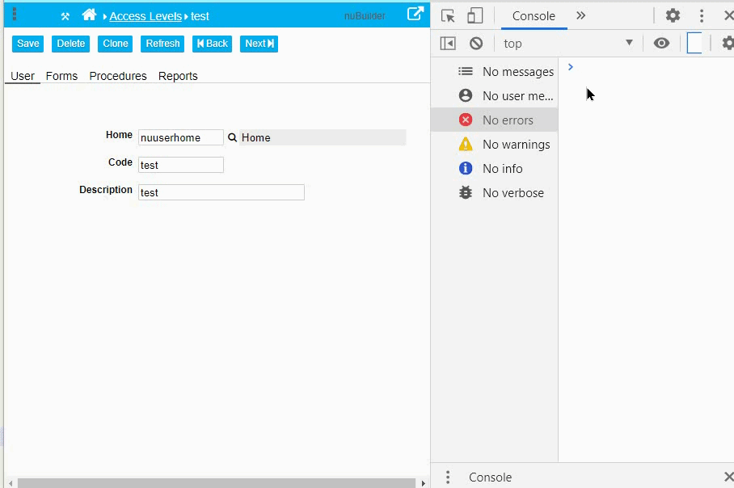

### Issue: 

Call nuSetVerticalTabs() (to sets the Tabs of an Edit Form Vertically to the Left).

Then resize the browser window (e.g. full screen / F11).

What happens? All objects are shifted downwards.


<p align="left">
  
</p>


### Fix:

In nuforms.js, add this line (e.g. after line 51):

```javascript
window.nuVerticalTabs = false;
```

In nuforms.js, add this code in the function nuSetVerticalTabs()

```javascript
window.nuVerticalTabs = true;
```


Replace nuResize() in index.php with this function:

```javascript
	function nuResize(){

		var w = window.innerWidth;
		
		if (! window.nuVerticalTabs) {		
			$('#nuTabHolder').css('width', w);
		}
		
		$('#nuTabHolder').css('width', w);
			
		$('#nuActionHolder').css('width', w);
		$('#nuBreadcrumbHolder').css('width', w);
		
		$('.nuTabTitleColumn').css('width', w);
		$('body').css('width', w);
				
	}
```  
