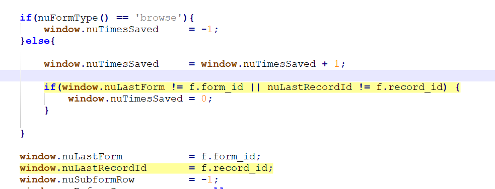

### Issue: 

1. Open an Edit Screen, e.g. an existing record
2. A click on a button will open another record in the same Breadcrumb: nuForm(nuGetProperty('form_id'),'some_other_record_id' , '', '', '1');
3. window.nuTimesSaved is incremented, which is wrong (no saving has taken place!)
4. Consequently, nuHasBeenSaved() returns 1, which is also not correct

### Fix:

Fix: Set Window.nuLastRecordId = f.record_id and compare its value with f.record_id when nuBuildForm() is called.
(In other words: When another record is opened in the same breadcrumb, do not increment nuTimesSaved)

  

